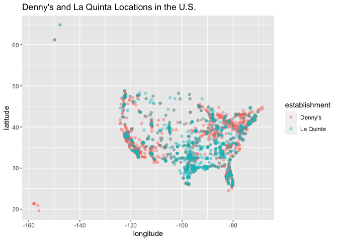
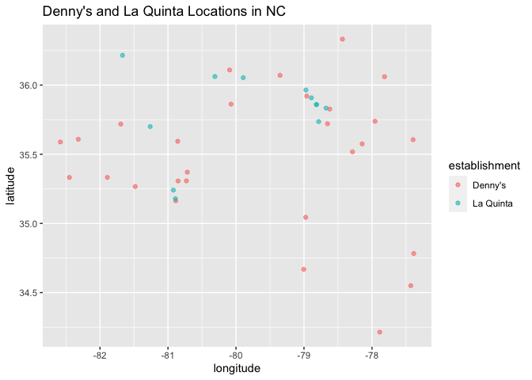
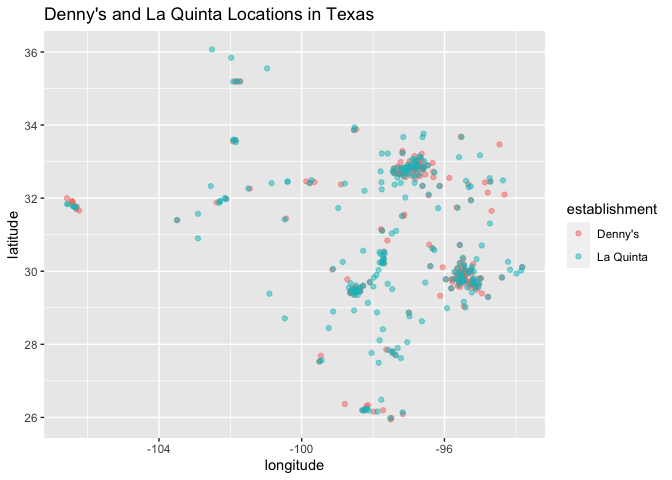

Lab 04 - La Quinta is Spanish for next to Denny’s, Pt. 1
================
Conor Lacey
02-04-2023

### Load packages and data

``` r
suppressWarnings(library(tidyverse))
library(dsbox) 
```

``` r
states <- read_csv("data/states.csv")
```

### Exercise 1

``` r
dn<-dennys
nrow(dn)
```

    ## [1] 1643

``` r
ncol(dn)
```

    ## [1] 6

In the dennys dataset, there are 1,643 row and 6 columns. Each row
represents an individual dennys location. The variables in this data set
include…

``` r
colnames(dn)
```

    ## [1] "address"   "city"      "state"     "zip"       "longitude" "latitude"

### Exercise 2

Now let’s look at the La Quinta dataset.

``` r
lq<-laquinta
nrow(lq)
```

    ## [1] 909

``` r
ncol(lq)
```

    ## [1] 6

The La Quinta dataset has 909 rows and 6 columns. Each row represents
one La Quinta location. The variables in the dataset are as follows:

``` r
colnames(lq)
```

    ## [1] "address"   "city"      "state"     "zip"       "longitude" "latitude"

### Exercise 3

Going to the La Quinta website there are La Quinta’s outside the U.S.
that include Canada, Mexico, China, New Zealand, Turkey, United Arab
Emirates, Chile, and Colombia.

Going to the Denny’s website it was actually difficult to find
information on locations outside the U.S. Fortunately, statista.com
provides data on this if you follow this link:
<https://www.statista.com/statistics/947495/number-of-dennys-restaurants/>

From this link we find that there are Denny’s outside the U.S. that
include Canada, Puerto Rico, Mexico, Phiippines, New Zealand, Honduras,
United Arab Emirates, Guatemala, Costa Ric, Guam, Indonesia, El
Salvador, United Kingdom, Aruba, Curacao N.V., and the Domincan
Republic.

### Exercise 4

I think one way to determine if a location is outside the U.S. for both
datasets is to see if the state abbreviations matches up with any of the
abbreviations in the state dataset. If it does not, then it must be
outside the U.S.

### Exercise 5

``` r
dn %>%
  filter(!(state %in% states$abbreviation))
```

    ## # A tibble: 0 × 6
    ## # … with 6 variables: address <chr>, city <chr>, state <chr>, zip <chr>,
    ## #   longitude <dbl>, latitude <dbl>

It appears there are no dennys located outside the U.S. in this dataset.

### Exercise 6

``` r
dn<-dn %>%
  mutate(country = "United States")
```

### Exercise 7

Fortunatley I took notes on this back in exercise 3. Going to the La
Quinta website there are La Quinta’s outside the U.S. that include
Canada, Mexico, China, New Zealand, Turkey, United Arab Emirates, Chile,
and Colombia.

### Exercise 8

``` r
lq<-lq %>%
  mutate(country = case_when(
    state %in% state.abb     ~ "United States",
    state %in% c("ON", "BC") ~ "Canada",
    state == "ANT"           ~ "Colombia",
    state %in% c("CH","SL","AG","VE", "PU")  ~ "Mexico"
  ))

lq <- lq %>%
  filter(country == "United States")
```

### Exercise 9

``` r
dn %>%
  count(state) %>%
  inner_join(states, by = c("state" = "abbreviation"))
```

    ## # A tibble: 51 × 4
    ##    state     n name                     area
    ##    <chr> <int> <chr>                   <dbl>
    ##  1 AK        3 Alaska               665384. 
    ##  2 AL        7 Alabama               52420. 
    ##  3 AR        9 Arkansas              53179. 
    ##  4 AZ       83 Arizona              113990. 
    ##  5 CA      403 California           163695. 
    ##  6 CO       29 Colorado             104094. 
    ##  7 CT       12 Connecticut            5543. 
    ##  8 DC        2 District of Columbia     68.3
    ##  9 DE        1 Delaware               2489. 
    ## 10 FL      140 Florida               65758. 
    ## # … with 41 more rows

``` r
lq %>%
  count(state) %>%
  inner_join(states, by = c("state" = "abbreviation"))
```

    ## # A tibble: 48 × 4
    ##    state     n name           area
    ##    <chr> <int> <chr>         <dbl>
    ##  1 AK        2 Alaska      665384.
    ##  2 AL       16 Alabama      52420.
    ##  3 AR       13 Arkansas     53179.
    ##  4 AZ       18 Arizona     113990.
    ##  5 CA       56 California  163695.
    ##  6 CO       27 Colorado    104094.
    ##  7 CT        6 Connecticut   5543.
    ##  8 FL       74 Florida      65758.
    ##  9 GA       41 Georgia      59425.
    ## 10 IA        4 Iowa         56273.
    ## # … with 38 more rows

California, Texas, and Florida have the most Denny’s locations while
Delaware, DC, and Vermont have the fewest. I’m not super surpised by
this considering California and Florida are popular vacation spots and
Texas is a very large state. Delaware and DC are not as big and vermont
is not a popular place to live. Denny’s I suspect would want to have
locations where there are large masses of people.

La Quinta locations follow the same trend with California, Texas, and
Florida having the most. However, Texas has the most by far with 237
locations! Maine and Vermont have the least locations. I’m not surprised
by this given my previous reasoning.

### Exercise 10

``` r
dn <- dn %>%
  mutate(establishment = "Denny's")
lq <- lq %>%
  mutate(establishment = "La Quinta")
```

``` r
dn_lq <- bind_rows(dn, lq)
```

``` r
ggplot(dn_lq, mapping = aes(x = longitude,
                            y = latitude,
                            color = establishment)) +
  geom_point(alpha=0.4)+
  labs(title = "Denny's and La Quinta Locations in the U.S.")
```

<!-- -->

The graph coincides with my answer to exercise 9. Clearly California,
Florida, and Texas have the most locations. However, I am noticing now
that there are a lot of Denny’s concentrated in the northeast while La
Quintas are concentrated more in the south.

### Exercise 11

``` r
dn_lq %>% filter(state == "NC") %>%
  ggplot(mapping = aes(x = longitude,
                       y = latitude,
                       color = establishment)) +
  geom_point(alpha=0.6)+
  labs(title = "Denny's and La Quinta Locations in NC")
```

<!-- -->

Looks like Mitch Hedberg’s joke kinda holds in North Carolina. There are
a few clusters with both Denny’s and La Quintas, however for the most
part there are a lot of La Quintas with no Denny’s next to them!

### Exercise 12

``` r
dn_lq %>% filter(state == "TX") %>%
  ggplot(mapping = aes(x = longitude,
                       y = latitude,
                       color = establishment)) +
  geom_point(alpha=0.5)+
  labs(title = "Denny's and La Quinta Locations in Texas")
```

<!-- -->

Looks like Mitch Hedberg’s joke holds in Texas! There are a lot of
clusters with both Denny’s and La Quintas.
